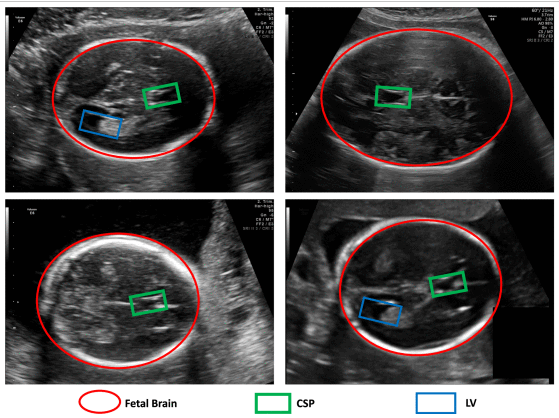

# Public Datasets (3/3)

## (1/3) FETAL_PLANES_DB: Common maternal-fetal ultrasound images from Spain
### Highlights
* Common maternal-fetal ultrasound images from Spain (2.1 GB)
* License: Creative Commons Attribution 4.0 International (CC BY 4.0)
* Total Images (patients): 12,400 images from 1,792 patients
* Image Dimension [pixelx]: 692 x 480; 640 x 392; 768 x 519; 707 x 531; 745 x 559; 959 x 661; etc
* Published June 23, 2020 | Version 1.0
* Link [[zenodo]](https://zenodo.org/records/3904280); 
* [article-scientific-reports](https://www.nature.com/articles/s41598-020-67076-5)
* [[pre-print]](https://arxiv.org/abs/2209.09610)
* [[google-scholar]]https://scholar.google.com/scholar?cites=2863764666513532768)

### Overview
A large dataset of routinely acquired maternal-fetal screening ultrasound images collected from two different hospitals by several operators and ultrasound machines. All images were manually labeled by an expert maternal fetal clinician. Images are divided into 6 classes: four of the most widely used fetal anatomical planes (Abdomen, Brain, Femur and Thorax), the mother’s cervix (widely used for prematurity screening) and a general category to include any other less common image plane. Fetal brain images are further categorized into the 3 most common fetal brain planes (Trans-thalamic, Trans-cerebellum, Trans-ventricular) to judge fine grain categorization performance. Meta information (patient number, us machine, operator) is also provided, as well as the training-test split used in the Nature Sci Rep paper.

The research leading to these results has received funding from Transmural Biotech SL, "LaCaixa" Foundation under grant agreements LCF/PR/GN14/10270005 and LCF/PR/GN18/10310003 the Instituto de Salud Carlos III (PI16/00861, PI17/00675) within the Plan Nacional de I+D+I and cofinanced by ISCIII-Subdirección General de Evaluación together with the Fondo Europeo de Desarrollo Regional (FEDER) "Una manera de hacer Europa", Cerebra Foundation for the Brain Injured Child (Carmarthen, Wales, UK), Cellex Foundation and AGAUR under grant 2017 SGR nº 1531. Additionally, EE has received funding from the Departament de Salut under grant SLT008/18/00156. 

If you find this dataset useful, please cite:
```
    @article{Burgos-ArtizzuFetalPlanesDataset,
      title={Evaluation of deep convolutional neural networks for automatic classification of common maternal fetal ultrasound planes},
      author={Burgos-Artizzu, X.P. and Coronado-Gutiérrez, D. and Valenzuela-Alcaraz, B. and Bonet-Carne, E. and Eixarch, E. and Crispi, F. and Gratacós, E.},
      journal={Nature Scientific Reports}, 
      volume={10},
      pages={10200},
      doi="10.1038/s41598-020-67076-5",
      year={2020}
    } 
```

* Notes
	* "Fetal brain images are further categorized into the 3 most common fetal brain planes (Trans-thalamic, Trans-cerebellum, Trans-ventricular) to judge fine grain categorization performance."


### Download dataset: https://zenodo.org/records/3904280/files/FETAL_PLANES_ZENODO.zip
```
mkdir -p ~/datasets/FETAL_PLANES_DB_2020 && cd ~/datasets/FETAL_PLANES_DB_2020
wget https://zenodo.org/records/3904280/files/FETAL_PLANES_ZENODO.zip #[1.9GB]
unzip FETAL_PLANES_ZENODO.zip
rm FETAL_PLANES_ZENODO.zip
```

### Dataset details, size, path
* Dimension [pixelx]: 692 x 480; 640 x 392; 768 x 519; 707 x 531; 745 x 559; 959 x 661; etc
* Type: PNG
* Path tree
```
$ tree -fs
[       4096]  .
├── [     909943]  ./FETAL_PLANES_DB_data.csv
├── [     386348]  ./FETAL_PLANES_DB_data.xlsx
├── [     708608]  ./Images
    ├── [     197528]  ./Images/Patient00001_Plane1_10_of_15.png
    ├── [     298355]  ./Images/Patient00001_Plane1_11_of_15.png
    ├── [     307171]  ./Images/Patient00001_Plane1_12_of_15.png
    ├── [     288376]  ./Images/Patient00001_Plane1_13_of_15.png
    ├── [     263471]  ./Images/Patient00001_Plane1_14_of_15.png

	...

    ├── [     181924]  ./Images/Patient01791_Plane5_1_of_1.png
    ├── [     214864]  ./Images/Patient01792_Plane2_1_of_1.png
    ├── [     227836]  ./Images/Patient01792_Plane3_1_of_1.png
    ├── [     217875]  ./Images/Patient01792_Plane5_1_of_1.png
    └── [     206491]  ./Images/Patient01792_Plane6_1_of_1.png

1 directory, 12403 files
```

## (2/3) Maternal fetal ultrasound planes from low-resource imaging settings in five African countries
### Highlights
* Ultrasound planes from five African countries (456 items, totalling 55.7 MB)
* License: Creative Commons Attribution 4.0 International (CC BY 4.0)
* Total Images: 456 items
* Image Dimensions: 959 x 661 pixels
* Published February 6, 2023 | Version v1.0
* Link [[zenodo]](https://zenodo.org/record/7540448); 
* [[pre-print]](https://arxiv.org/abs/2209.09610)
* [[google-scholar]](https://scholar.google.com/scholar?cites=7480279748661179087)

### Overview
> This resource is a dataset of routinely acquired maternal-fetal screening ultrasound images collected in five centers of five countries in Africa (Malawi, Egypt, Uganda, Ghana and Algeria) that is associated to the journal article Sendra-Bacells et al. "Generalisability of fetal ultrasound deep learning models to low-resource imaging settings in five African countries", Scientific Reports. The images correspond to the four most common fetal planes: abdomen, brain, femur and thorax. A CSV file is provided where image filenames are associated to plane types and patient number as well as the partitioning in training and testing splits as used in the associated publication.


### Download dataset
```
mkdir -p ~/datasets/african-fetal-us-2023 && cd ~/datasets/african-fetal-us-2023
wget https://zenodo.org/records/7540448/files/Zenodo_dataset.tar.xz
tar xf Zenodo_dataset.tar.xz #[41MB]
rm Zenodo_dataset.tar.xz
#mv all images to root data path
```

### Images details

#### pixel size

The size of images are:
Algeria: 500 x 430 pixel size
Egypt: 400 x 450 pixel size
Ghana: 500 x 500 pixel size
Malawi: 500 x 400 pixel size
Uganda: 600 x 500 pixel size

#### path three 
```
$ tree -fs
[       4096]  .
├── [      20901]  ./African_planes_database.csv
├── [       4096]  ./Algeria #100files
│   ├── [     123066]  ./Algeria/patient001_DZA_plane0.png
│   ├── [     124184]  ./Algeria/patient001_DZA_plane1.png
│   ├── [     101800]  ./Algeria/patient001_DZA_plane2.png
│   ├── [     123267]  ./Algeria/patient001_DZA_plane3.png

...


├── [       4096]  ./Egypt #100files
│   ├── [     249784]  ./Egypt/patient001_EGY_plane0.png
│   ├── [     252127]  ./Egypt/patient001_EGY_plane1.png
│   ├── [     217399]  ./Egypt/patient001_EGY_plane2.png
│   ├── [     246891]  ./Egypt/patient001_EGY_plane3.png


...


├── [       4096]  ./Ghana #75files
│   ├── [      77436]  ./Ghana/patient002_GHA_plane0.png
│   ├── [      85276]  ./Ghana/patient002_GHA_plane1.png
│   ├── [      71120]  ./Ghana/patient002_GHA_plane2.png
│   ├── [      78345]  ./Ghana/patient003_GHA_plane0.png
│   ├── [      81361]  ./Ghana/patient003_GHA_plane1.png

...

├── [       4096]  ./Malawi #100files
│   ├── [      84496]  ./Malawi/patient001_MWI_plane0.png
│   ├── [      88862]  ./Malawi/patient001_MWI_plane1.png
│   ├── [      82054]  ./Malawi/patient001_MWI_plane2.png
│   ├── [      88791]  ./Malawi/patient001_MWI_plane3.png
│   ├── [      80988]  ./Malawi/patient002_MWI_plane0.png

...

└── [       4096]  ./Uganda #75files
    ├── [     124477]  ./Uganda/patient018_UGA_plane0.png
    ├── [     124053]  ./Uganda/patient018_UGA_plane1.png
    ├── [     114293]  ./Uganda/patient018_UGA_plane2.png
    ├── [     141476]  ./Uganda/patient022_UGA_plane0.png
    ├── [     128595]  ./Uganda/patient022_UGA_plane1.png


5 directories, 451 files
```

### Puting images into one path

```
cd $HOME/repositories/datasets/african-fetal-us-dataset
mkdir Images
cp Algeria/*.png Images/
cp Egypt/*.png Images/
cp Ghana/*.png Images/
cp Malawi/*.png Images/
cp Uganda/*.png Images/
```

### References
> Sendra-Balcells, Carla, Víctor M. Campello, Jordina Torrents-Barrena, Yahya Ali Ahmed, Mustafa Elattar, Benard Ohene-Botwe, Pempho Nyangulu et al. 
> "Generalisability of fetal ultrasound deep learning models to low-resource imaging settings in five African countries." 
> Scientific reports 13, no. 1 (2023): 2728.


## (3/3) Large-Scale Annotation Dataset for Fetal Head Biometry in Ultrasound Images
### Highlights
* Diverse Fetal Head Images, including segmentations for fetal head, CPS and LP (2.4 GB).
* License: Creative Commons Attribution 4.0 International (CC BY 4.0)
* Total Images: 3,832
* Image Dimensions: 959 x 661 pixels
* Published March 21, 2023 | Version v2
* Link https://zenodo.org/records/8265464

## Overview
> This dataset provides a comprehensive collection of ultrasound images focusing on fetal head biometry. 
The dataset includes segmentation of fetal head ultrasound images are based on four categories: background, fetal brain, ***cavum septum pellucidum (CSP)***, and ***lateral ventricles (LV)***.
The dataset is designed to support the development and evaluation of image segmentation and biometric analysis algorithms in prenatal diagnostics. The images have been carefully annotated by experts in the field, ensuring high-quality data for researchers.  
* "Segmenting internal structures like the CSP and LV provides deeper insights into fetal neurodevelopment [3]. The CSP, a naturally occurring division between the left and right hemispheres, can serve as an early indicator of potential brain abnormalities [15]. The LV, on the other hand, are fluid-filled cavities related to conditions such as ventriculomegaly and neural tube defects [16]. Accurate segmentation of these structures is critical for monitoring fetal brain development, thereby enabling better-informed parental decisions and preparing the clinical team for post-birth interventions."


### Example of the dataset
  
**Fig** Example of location of Fetal Brain plain, CSP, and LV in the ultrasound image (fig1 from Alzubaidi et al. 2024)


### Download
```
wget https://zenodo.org/api/records/8265464/files-archive -O DiverseFetalHeadImages-orginal-image.zip
```

### Reference
Alzubaidi, Mahmood, Uzair Shah, Marco Agus, and Mowafa Househ. "FetSAM: Advanced Segmentation Techniques for Fetal Head Biometrics in Ultrasound Imagery." IEEE Open Journal of Engineering in Medicine and Biology (2024). 
[article](https://ieeexplore.ieee.org/abstract/document/10480532/)
[google-citations](https://scholar.google.com/scholar?cites=14101294037409299090&as_sdt=2005&sciodt=0,5&hl=en)
